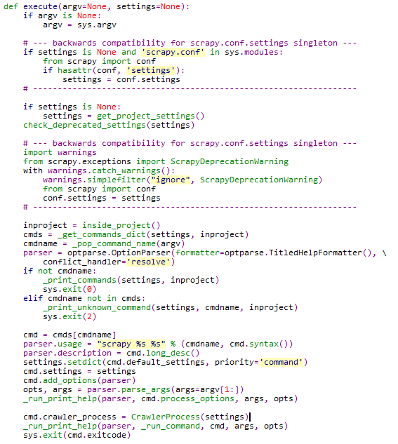
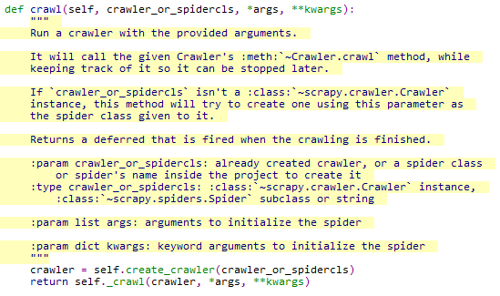
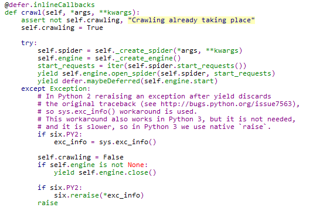
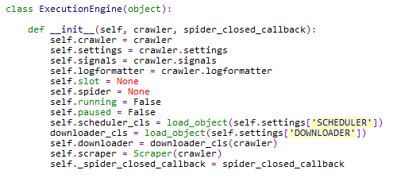
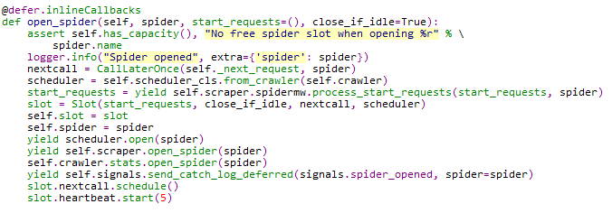

#scrapy
##1. cmdline main()->excute()


##2. cmdline excute()



##3. cmdline _run_print_help()


##4. cmdline _run_command()


##5. commands/crawler.py run()


##6. crawler.py CrawlerProcess.crawl()



##7. crawler.py Crawler.crawl()->engine.open_spider()



##8. 先看 core/engine.py ExecutionEngine.__init__() engine成员：



##9. core/engine.py ExecutionEngine.open_spider()：



在图 9 中就能看出 scrapy 官方的处理架构图了：


详细说明：

- ```start_requests``` 是在步骤 7 中定义的
- ```scrapy.spidermw``` 即 Spider Middlewares
- ```schedule``` 即 调度器，默认类为 SCHEDULER = 'scrapy.core.scheduler.Scheduler'
- ```scrapy.open_spider()``` 中即 ItemPipeline 开始处理spider, 默认类为 ITEM_PROCESSOR = 'scrapy.pipelines.ItemPipelineManager'
- ```crawler.stats``` 属于一种状态记录的类，用来记录整个爬取过程中的关键状态，默认类为 STATS_CLASS = 'scrapy.statscollectors.MemoryStatsCollector'，
- ```signals``` 使用开源的pydispatch进行消息发送和路由，这里发送了一个spider_opened消息并记录日志，所有关注这个消息
的函数都会被调用,同时会向关注模块注册的函数传递一个spider变量，这样关注函数就可以使用spider来获取自己关心的信息进行一些操作了。
- ```slot.nextcall``` 即 CallLaterOnce 封装的下载器，通过 slot.nextcall.schedule() 来调用下载器，调用路径为``` CallLaterOnce->schedule -> _next_request() -> _next_request_from_scheduler() -> _download() -> downloader.fetch(request, spider)```。下载器的返回值是通过内部回调方法的方式来返回响应的。返回之后由 ```_handle_downloader_output```又根据配置的下载中间件来决定继续发新请求或者停止。
- ```slot.heartbeat``` 是调用reactor.callLater(delay, self)并设置心跳为5秒。Slot 可以理解为一个request的生命周期, 其内部成员如下：


扩展阅读： 

- [scrapy 架构概览](http://scrapy-chs.readthedocs.io/zh_CN/0.24/topics/architecture.html)
- [scrapy 默认配置](https://github.com/scrapy/scrapy/blob/master/scrapy/settings/default_settings.py)
- [scrapy 执行总流程](./imgs/full-flow.jpg)——原文在[这](http://blog.csdn.net/happyanger6/article/details/53401912)

